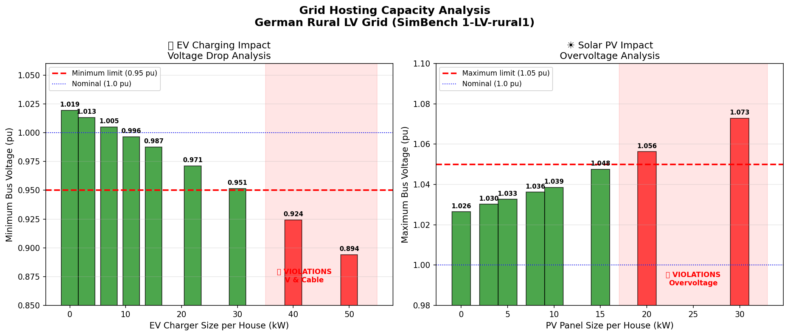
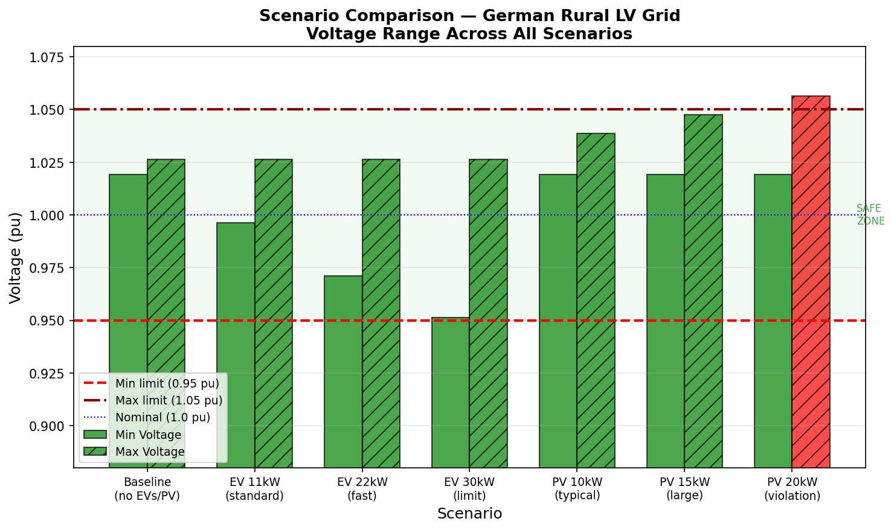

# Grid Integration Study - German Rural LV Network

## Kurzbeschreibung

Dieses Projekt untersucht, wie sich Elektrofahrzeuge und Photovoltaikanlagen 
auf ein deutsches Niederspannungsnetz auswirken. Mit pandapower und SimBench 
habe ich die Hosting Capacity eines ländlichen Netzes berechnet, also wie 
viel EV und PV Leistung das Netz verträgt, bevor Spannungsprobleme auftreten.

---

## Why I built this

I am a Master's student in Power Engineering and Renewable Energy at BTU 
Cottbus-Senftenberg, with a focus on solar PV design, grid integration, 
energy yield analysis and grid calculation. I wanted to get into grid 
integration or solar PV design work as a Werkstudent, but I had no hands 
on simulation experience yet.

So I spent 5 days building this project from scratch, starting from zero, 
installing Python, learning pandapower for the first time, and figuring out 
how a real power flow study actually works. No university assignment, no 
supervisor. Just me, open source tools, and a lot of trial and error.

---

## The hardest part

Honestly, understanding the load balance took me the longest. When I added 
equal amounts of EV load and PV generation at the same time, the voltages 
did not change at all, because they were cancelling each other out. I had 
to stop, think about what was actually happening physically, and restructure 
the whole analysis to study EV and PV separately first. That is when the 
results finally started making sense.

---

## What I found

I expected a rural grid to fail quickly under stress. Rural grids have long 
cables and are generally considered weak. But this SimBench grid was more 
robust than I expected.

The bigger surprise was that solar PV turned out to be more dangerous than 
EV charging for this particular grid. EVs pull voltage down, solar pushes 
it up and this grid hit the upper voltage limit from solar before it hit 
the lower limit from EVs.

EV charging safe up to 30 kW per house, violations appear at 40 kW
Solar PV safe up to 15 kW per house, violations appear at 20 kW

---

## Results

Hosting Capacity Analysis:

Scenario Comparison:

---

## What I actually did

I loaded a real German rural LV benchmark grid from SimBench, 15 buses, 
13 households, 1 transformer. The coordinates in the data point to a real 
rural area in Mecklenburg-Vorpommern.

First I ran a baseline power flow to confirm the grid was healthy. Then I 
added EV chargers of increasing size to all 13 houses and watched the 
voltage drop step by step. Then I did the same with rooftop solar panels 
and watched the voltage rise. Finally I ran a systematic sweep to find 
exactly where violations first appear.

Everything is in the Jupyter notebook, every step, every result, every plot.

---

## Tools

pandapower: power flow simulation
SimBench: real German benchmark grid data
Python, Jupyter Notebook, matplotlib
100% open source, nothing paid

---

## About me

Master's student in Power Engineering and Renewable Energy at BTU Cottbus-Senftenberg.
Main focus: solar PV design, grid integration, energy yield analysis, grid calculation.

Currently looking for a Werkstudent position in grid integration or PV system design.

[LinkedIn — Pavan Kalyan Srinivasa Reddy](https://www.linkedin.com/in/pavan-kalyan-srinivasa-reddy-110127263/)
